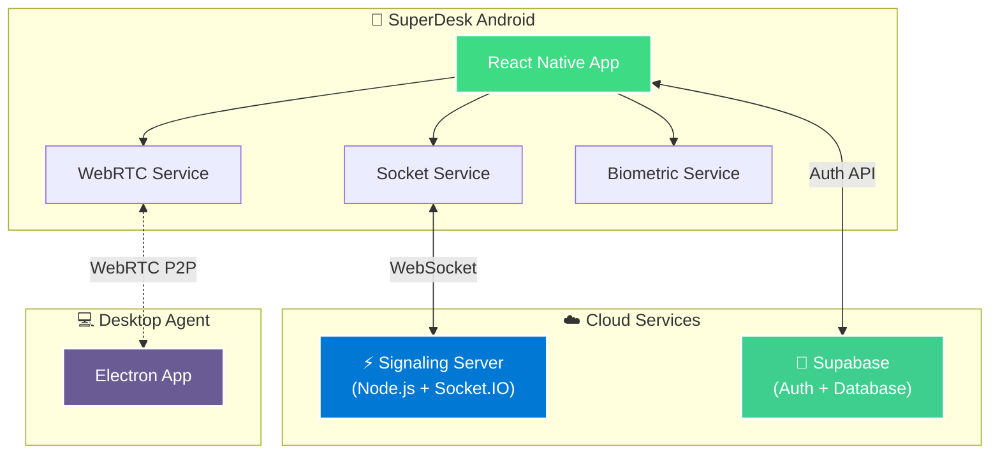

<div align="center">

# 📱 SuperDesk Android

### Remote Desktop Control from Your Pocket

[](https://android.com)
[](https://reactnative.dev)
[](LICENSE)
[](https://typescriptlang.org)

<p>
  
</p>

**Remote control • Biometric login • Virtual joystick • P2P file transfer • Voice chat**

[🚀 Get Started](#-quick-start) · [📖 How to Use](#-usage) · [🏗️ Architecture](#-architecture) · [🖥️ Desktop App](https://github.com/neeer4j/SuperDesk)

</div>

---

## ✨ Features

<table>
<tr>
<td width="50%">

### 🖥️ Remote Desktop
- **Real-time Streaming** with low-latency WebRTC
- **Touch Controls** – Tap, drag, pinch-to-zoom
- **Virtual Joystick** – Precision mouse with haptic feedback
- **Native Keyboard** – Direct input injection

</td>
<td width="50%">

### 📂 File Transfer
- **P2P Direct Transfer** via WebRTC DataChannel
- **Send/Receive Files** – Photos, documents, any type
- **Progress Tracking** with cancel support
- **Auto-Save** to Downloads folder

</td>
</tr>
<tr>
<td width="50%">

### 🔐 Security & Auth
- **Biometric Login** – Face ID, Touch ID, Fingerprint
- **Supabase Auth** – Secure email OTP
- **Configurable Timeout** – 1 min to 1 hour
- **End-to-End Encryption** – DTLS-SRTP

</td>
<td width="50%">

### 👥 Social Features
- **Friends System** – Add contacts by username
- **Quick Connect** – Join friends' sessions instantly
- **Real-time Chat** – Message during sessions
- **Session History** – Track past connections

</td>
</tr>
<tr>
<td width="50%">

### 📡 Host Mode
- **Share Android Screen** to PC viewers
- **8-Digit Session Codes** – Easy, secure sharing
- **Session Management** – Start, pause, end

</td>
<td width="50%">

### 🎨 Experience
- **Light/Dark Themes** – System-aware
- **Haptic Feedback** – Tactile touch responses
- **Fluid Animations** – Reanimated powered
- **Voice Chat** – Real-time audio streaming

</td>
</tr>
</table>

---

## 🏗️ Architecture



| Component | Description |
|:----------|:------------|
| **React Native App** | Main mobile application with all UI screens |
| **WebRTC Service** | Handles P2P video/audio/data connections |
| **Socket Service** | WebSocket signaling for session management |
| **Biometric Service** | Face ID/Touch ID/Fingerprint authentication |
| **Supabase** | Cloud auth (Email OTP) and user database |
| **Signaling Server** | Routes WebRTC offers/answers between peers |

---

## 🚀 Quick Start

### Prerequisites

| Requirement | Version |
|-------------|---------|
| Node.js | 20+ |
| Android Studio | Latest |
| JDK | 17 |
| Device | Android 8.0+ with Developer Options |

### Installation

```bash
# Clone the repository
git clone https://github.com/neeer4j/SuperDesk-Mobile.git
cd SuperDesk-Mobile/SuperDeskAndroid

# Install dependencies
npm install

# Setup environment variables
cp .env.example .env
# Edit .env with your Supabase credentials

# Start Metro bundler
npm start

# Run on Android (separate terminal)
npm run android
```

> **Note:** See [SECURITY.md](./SECURITY.md) for environment variable details.

---

## 📖 Usage

<details>
<summary><b>🖥️ Control PC from Phone</b></summary>

1. Start **SuperDesk Agent** on your Windows PC
2. Note the **8-digit Session ID** displayed
3. Open **SuperDesk Android** → **Join** tab
4. Enter the code and tap **Connect**
5. Use touch gestures or virtual joystick to control!

</details>

<details>
<summary><b>📡 Share Your Android Screen</b></summary>

1. Go to the **Host** tab
2. Tap **Start Sharing** to generate a session code
3. Share the code with the PC user
4. Your screen streams once they connect

</details>

<details>
<summary><b>📂 Transfer Files</b></summary>

1. During an active session, open the side drawer
2. Navigate to **Files** section
3. Tap **Send File** to pick a document or image
4. Track transfer progress in real-time

</details>

<details>
<summary><b>🔐 Enable Biometric Login</b></summary>

1. Go to **Settings** from the side drawer
2. Toggle **Biometric Authentication** ON
3. Select re-authentication timeout (1 min – 1 hour)
4. Next login will prompt for Face ID/Fingerprint

</details>

<details>
<summary><b>👥 Add Friends</b></summary>

1. Go to **Friends** tab
2. Tap the **+** button
3. Enter friend's username
4. Once accepted, see their online status and join sessions directly

</details>

---

## ⚙️ Configuration

### Server Endpoint

Modify in `src/services/SocketService.ts`:

```typescript
const SOCKET_URL = 'https://your-server-url.azurewebsites.net';
```

### WebRTC Configuration

TURN/STUN servers are fetched dynamically with fallback. See `src/services/WebRTCService.ts`.

---

## 📁 Project Structure

```
SuperDeskAndroid/
├── 📂 src/
│   ├── 📂 components/      # UI components (Joystick, SideDrawer, etc.)
│   ├── 📂 context/         # React Context (Theme)
│   ├── 📂 navigation/      # Stack and Tab navigators
│   ├── 📂 screens/         # 13 app screens
│   ├── 📂 services/        # 12 service modules
│   │   ├── BiometricService    # Face ID/Fingerprint auth
│   │   ├── WebRTCService       # P2P video/audio/data
│   │   ├── SocketService       # WebSocket signaling
│   │   ├── FileTransferService # P2P file transfers
│   │   ├── HapticService       # Touch feedback
│   │   ├── SessionHistoryService # Session logging
│   │   └── ...
│   ├── � theme/           # Design system tokens
│   └── 📂 utils/           # Utilities (Logger)
└── 📂 android/             # Native Android code
```

---

## 🔐 Security

| Feature | Implementation |
|---------|----------------|
| **Stream Encryption** | DTLS-SRTP (WebRTC standard) |
| **Signaling** | WSS (WebSocket Secure) |
| **Session IDs** | Ephemeral, randomly generated |
| **File Transfer** | P2P only – never touches server |
| **Authentication** | Supabase Email OTP |
| **Biometrics** | Device-native Face ID/Touch ID/Fingerprint |

---

## 🐛 Troubleshooting

<details>
<summary><b>Connection Issues</b></summary>

- Verify signaling server is running and accessible
- Check firewall allows WebRTC traffic (UDP ports)
- Ensure stable network connection
- Try reconnecting the session

</details>

<details>
<summary><b>Biometric Not Working</b></summary>

- Ensure device has biometrics enrolled in system settings
- Check app has biometric permissions granted
- Try toggling the setting off/on in app settings

</details>

<details>
<summary><b>File Transfer Issues</b></summary>

- Verify both peers have active WebRTC connection
- Check file size is reasonable for mobile data
- Ensure storage permissions are granted
- Try reconnecting the session

</details>

---

## 📄 License

This project is licensed under the **GNU General Public License v3.0**.

See the [LICENSE](LICENSE) file for details.

---

<div align="center">

**📱 SuperDesk Android** – Remote desktop control from your pocket.

Made with ❤️ by [neeer4j](https://github.com/neeer4j)

</div>
